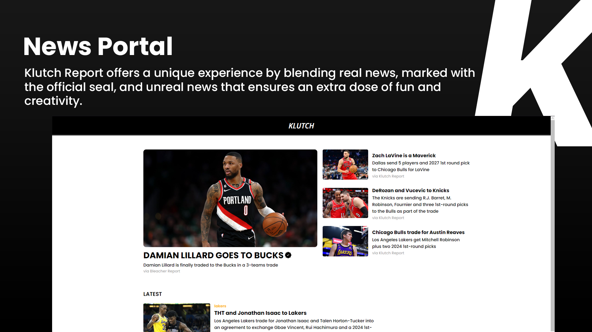

# Klutch Report - News Portal



Welcome to the Klutch Report repository, your go-to ReactJS application for basketball news. Klutch Report goes beyond traditional news platforms by offering a blend of real and fictional news, providing a unique and entertaining experience for basketball enthusiasts.

## Key Features
Klutch Report utilizes cutting-edge React and JavaScript concepts to create an immersive basketball news platform:

- Integration with a simulated JSON-server acting as a database.
- Effective implementation of React Hooks for seamless state management.
- Responsive and visually appealing design with modern CSS styles.
- Smooth navigation facilitated by React Router.

## Prerequisites

To run Klutch Report on your local machine, ensure you have the following installed:

- [Node.js](https://nodejs.org/) - Version 14 or higher.
- [npm](https://www.npmjs.com/) or [Yarn](https://yarnpkg.com/) for package management.

## Installation

1. Clone this repository to your machine:

   ```bash
   git clone https://github.com/jorgeprj/klutch-report-react.git
   ```

2. Navigate to the project directory:

   ```bash
   cd taskee
   ```

3. Install project dependencies:

   ```bash
   npm install
   # or
   yarn install
   ```

## How to Use

To simulate the JSON Server and run the project, follow these steps:

1. Start the JSON Server to simulate the API:

   ```bash
   npm run backend
   # or
   yarn backend
   ```

   The server will be available at `http://localhost:5000`.

2. Start the React application:

   ```bash
   npm run dev
   # or
   yarn dev
   ```

The application will be available at `http://localhost:5173` by default.

## Contribution

If you'd like to contribute to the Bucks project, follow these steps:

1. Fork the repository.
2. Create your own development branch: `git checkout -b feature/feature-name`.
3. Make your changes and commit them: `git commit -m 'Add a new feature'`.
4. Push your branch: `git push origin feature/feature-name`.
5. Submit a Pull Request with your changes.

## License

This project is licensed under the [MIT License](LICENSE). Feel free to use and modify it as needed.

## Contact

For questions or suggestions, please contact [@jorgeprj](https://github.com/jorgeprj).